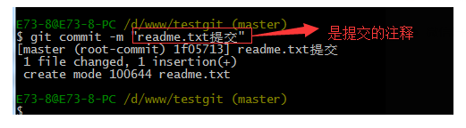
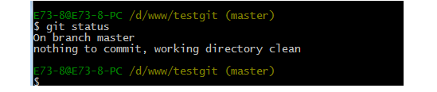
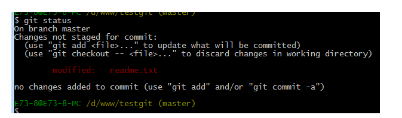
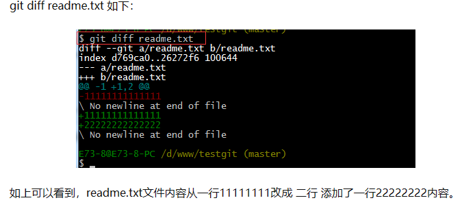
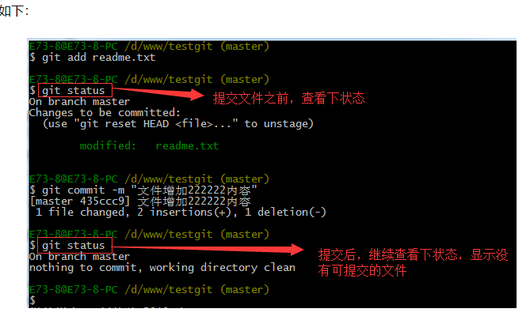

# 笔记上传GitHub

### * 以Typora(Markdown编辑器)为例

叙述之前，让我们先了解一下git的相关命令:

 **创建仓库**  **==git init==**  把这个目录变成git可以管理的仓库

- **添加文件到版本库中**(文件以readme.txt为例，内容如下：11111111)

  1. ==**git add** readme.txt==  把该文件(readme.txt)添加到暂存区里

     

  2. ==**git commit -m** **"** *readme.txt 1.0* **"**==(引号内斜体部分为提交的注释，无固定格式内容，但必须写！！！)  此命令告诉Git，把暂存区里的文件提交到仓库

     

  3. ==**git status**==  查看是否有文件未被提交

     

     若此时修改readme.txt文件的内容，比如在文件第二行添加22222222，此时使用git status

     

     提示我们文件已被修改，但未被提交

  4. ==**git diff** readme.txt==  查看文件内容

     

  5. 把修改的文件提交，即步骤1和步骤2

     

- 12

- 
