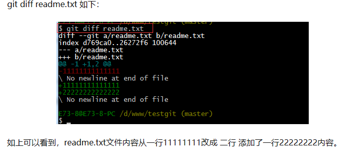

# 笔记上传GitHub


### * 以Typora(Markdown编辑器)为例


### git相关知识


叙述之前，让我们先了解一下git的相关命令:

#### git 配置

- `git config -l`  查看配置
- `git config --system --list`  查看系统配置
- `git config --global --list`  查看当前用户（global）配置
- `git config --global user.name`  设置用户名称  
- `git config --global user.email`  设置用户邮箱

#### git 工作原理


- workspace：工作区
- index/stage：暂存区
- local repository：本地仓库
- remote repository：远程仓库 


#### git 项目创建与文件操作

- **创建本地仓库**  

  **==git init==**  把这个目录变成git可以管理的本地仓库

  ==**git clone [url]**==  把远程仓库完全镜像一份至本地

- **添加文件到版本库中**(文件以readme.txt为例，内容如下：11111111)

  1. ==**git add** readme.txt==  把该文件(readme.txt)添加到暂存区里

     ==**git add .**==  把当前目录下所有文件添加到暂存区

     

  2. ==**git commit -m** **"** *readme.txt 1.0* **"**==(引号内斜体部分为提交的注释，无固定格式内容，但必须写！！！)  此命令告诉Git，把暂存区里的文件提交到仓库

     

  3. ==**git status**==  查看是否有文件未被提交

     

     若此时修改readme.txt文件的内容，比如在文件第二行添加22222222，此时使用git status

     

     提示我们文件已被修改，但未被提交

  4. ==**git diff** readme.txt==  查看文件内容

     

  5. 把修改的文件提交，即步骤1和步骤2
  
     
  
  6. 

- **git 配置忽略文件**

  

- git 分支命令

  ```bash
  #列出所有本地分支
  git branch
  
  #列出所有远程分支
  git branch -r
  
  #新建一个分支，但依然停留在当前分支
  git branch [branch.name]
  
  #新建一个分支，并切换到该分支
  git checkout -b [branch.name]
  
  #删除分支
  git branch -d [branch.name]
  
  #删除远程分支
  git push origin --delete [branch.name]
  git branch -dr [remote.branch.name]
  
  #合并指定分支到当前分支
  git merge [branch.name]
  ```

  

#### **Linux 命令**


